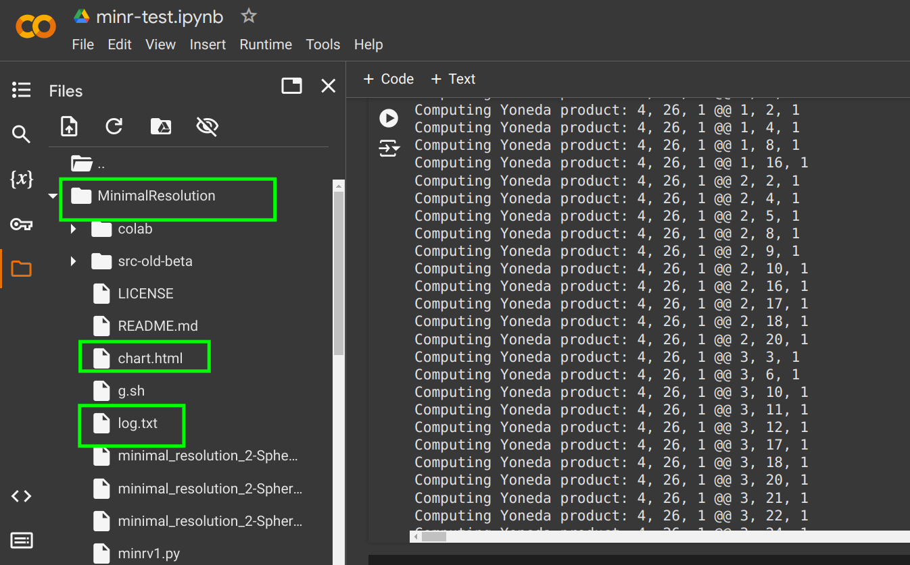
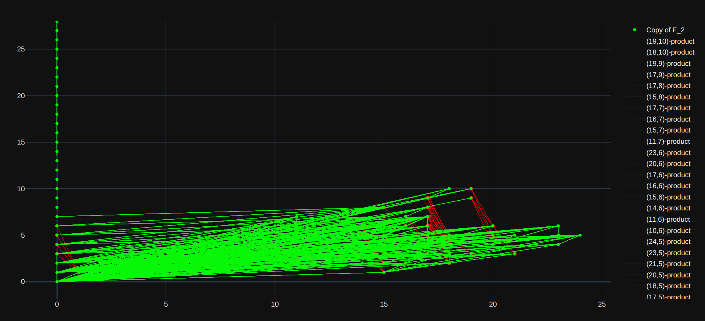
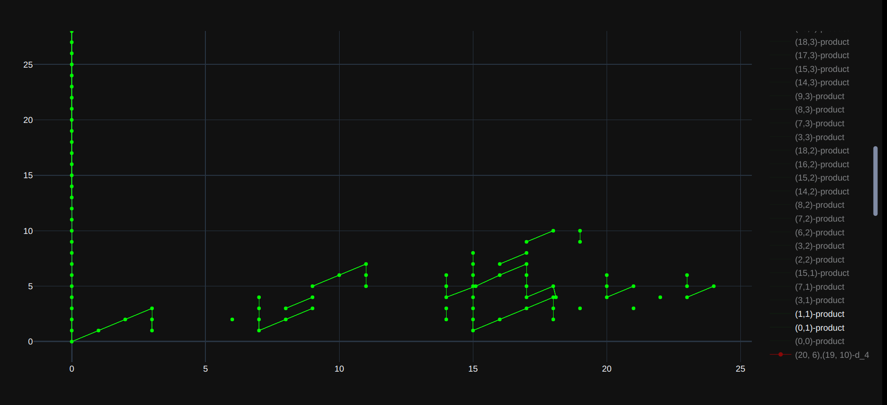

# MinimalResolution [proof-of-concept]

Proof-of-concept of computing minimal resolutions over the mod $p$ Steenrod algebra developed by me. This program constructs a free resolution of a finitely presented $\mathbb{F}_p-$module as an $\mathcal{A}_p-$module. It also computes chain map lifts of cohomology classes to compute Yoneda products.

# Requirements 

This software should be executed on ``GNU/Linux`` distributions.

1. Install ``Python``.
2. Install ``SageMath``.
3. Run ``pip install plotly``.
4. Run ``pip install jsons``.

# Usage (Linux users)

1. Provide a finitely presented $\mathbb{F}_p-$module by using the ``minimalResolution.createModule()`` method. The source code provides some examples.
2. Execute `g.sh` (or ``python -W ignore minrv1.py``).

You will get a plot resembling the computed `Ext groups` (``chart.html``), and the corresponding $E_2-$term with its Yoneda products will be saved in ``./log.txt`` for further inspection. The program also dumps the computed lifts and the minimal resolution into ``./*.obj`` files.

# Usage (non-Linux users)

Alternatively, you can run this program on [Google Colab](https://colab.google/) . You will need to hardcode a finitely presented module and then call ``minimalResolution.createModule()`` before running `g.sh`.

``WARNING``: the software is prone to high memory consumption since it relies on SageMath's mod $p$ linear algebra routines. This could lead to crashes or unexpected behavior. Beware of not reaching the maximum amount of RAM available on your device. Smaller primes tend to consume more memory. Ensure that you have at least 16 GB of RAM. 

# Parameters

* ``BOOL_COMPUTE_ONLY_ADDITIVE_STRUCTURE`` 
  - This parameter indicates whether the software should compute lifts or not.

* ``FIXED_PRIME_NUMBER`` 
  - This is the associated prime number used during the execution.
  - You must provide a prime number compatible with the finitely presented $\mathbb{F}_p-$module to consider.

* ``MAX_NUMBER_OF_RELATIVE_DEGREES`` 
  - This parameter accounts for the maximum relative (topological) degree to compute.
  - If you have 16 GB of RAM, this value should not exceed 60 for $p = 2$. It could reach approximately 130 for $p = 3$.
  - These values were obtained heuristically.

* ``MAX_NUMBER_OF_MODULES`` 
  - Accounts for the maximum $\mathcal{A}_p-$modules to compute in the minimal resolution.
  - It is set equal to `MAX_NUMBER_OF_RELATIVE_DEGREES` by default.

* ``NUMBER_OF_THREADS``
  - This parameter indicates the number of parallel processes that will be used to compute cochain lifts.

# Output example

The following diagrams illustrate the $E_2-$term associated with the sphere spectrum at $p = 2$ computed using this program.
The first diagram is usually quite saturated. To solve this, you have two possibilities: specify the Yoneda products of interest via the `cbk_filter()` method, or double-click on the `Copy of F_p` label and choose the products of interest.

